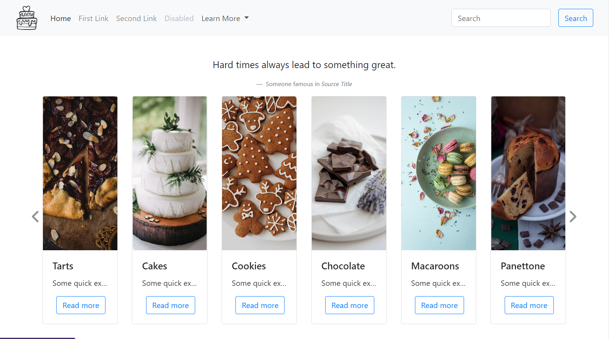

# my-bakery-app
> Project inspired by my hobbie 🎂
<!-- > Live demo [_here_](https://www.example.com). If you have the project hosted somewhere, include the link here. -->

## Table of Contents
<!-- * [General Info](#general-information) -->
* [Technologies Used](#technologies-used)
* [Features](#features)
* [Screenshots](#screenshots)
* [Setup](#setup)
* [Project Status](#project-status)
* [Room for Improvement](#room-for-improvement)
<!-- * [Usage](#usage) -->
<!-- * [Acknowledgements](#acknowledgements)
* [Contact](#contact) -->
<!-- * [License](#license) -->

<!-- ## General Information
- Provide general information about your project here.
- What problem does it (intend to) solve?
- What is the purpose of your project?
- Why did you undertake it?
<!-- You don't have to answer all the questions - just the ones relevant to your project. -->
 -->

## Technologies Used
- Tech 1 - version 1.0
- Tech 2 - version 2.0
- Tech 3 - version 3.0

## Features
List the ready features here:
- Welcome screen carousel
- Cards slider
- Modal Window

## Screenshots

## Setup
To run this project, install it locally using npm:

1. install node_modelues: npm install -g node-modules
2. install json-server: npx install -g json-server
3. run json-server: npx json-server db.json 
4. install webpack: npm install webpack webpack-cli --save-dev
5. bundle project using webpack: npx webpack

<!-- ## Usage
How does one go about using it?
Provide various use cases and code examples here.

`write-your-code-here`
 -->

## Project Status
Project is: _in progress_ 

## Room for Improvement

Room for improvement:
- Use classes ES6 instead of functions
- Pay attention to the naming of your methods and functions

To do:
- Add a form (cake-constructor) to modal window 
- Dinamically add field to cake-constructor
